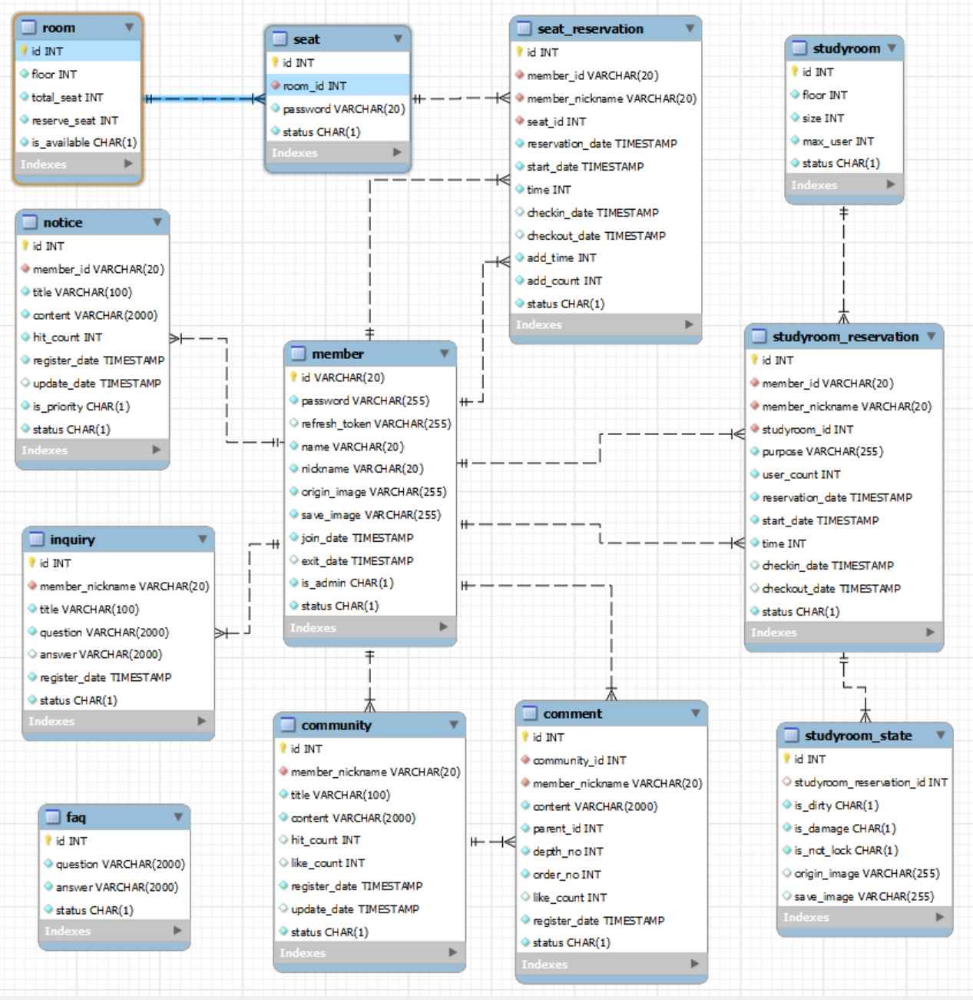

# SSAIBRARY

## First Planet Project

### FE 김지환 김창겸

### BE 김소윤 황정주

## 2022.12.14

Init project

## 2022.12.16

FE - Design Figma prototype  
BE - Gereate DB Table

## 2022.12.19

BE - Insert DB Dummy Data  
FE - Landing Page

## 2022.12.20

FE - Main Page, Account Page

## 2022.12.21

aws setting EC2

## 2022.12.22

aws setting RDS  
FE - assets, Reservation Page

BE- study room read

## 2022.12.23

FE - structuring

## 2022.12.24

BE - CRUD

## 12.25

BE - member, notice CRUD  
FE - History Page

## 12.26

BE - 명명규칙 통일, DTO 세분화, STS GIT 연동, SWAGGER 설정, reservation 관련 기본 패키지 생성  
FE - Community Page, Login Page

## 12.27

BE - Controller내 method 리턴값 ResponseEntity로 변경, community CRUD, NotFoundException 생성, 좌석예약 CRUD  
FE - SignUp Page

## 12.28

BE - 스터디룸예약 CRUD, 스터디룸예약 관련 DB FK  
FE - Account Modify Page, router config, Community Page

# DB ERD Diagram

# Version Info

node - 18.12.1 LTS  
mysql - 8.0.30
