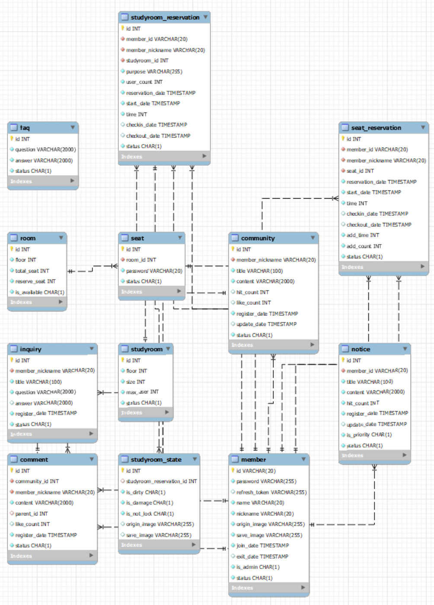

# SSAIBRARY

## First Planet Project

### FE 김지환 김창겸

### BE 김소윤 황정주

## 2022.12.14

Init project

## 2022.12.16

FE - Design Figma prototype  
BE - Gereate DB Table

## 2022.12.19

BE - Insert DB Dummy Data  
FE - Landing Page

## 2022.12.20

FE - Main Page, Account Page

## 2022.12.21

AWS setting EC2

## 2022.12.22

AWS setting RDS  
FE - assets, Reservation Page
BE- study room read

## 2022.12.23

FE - structuring, convention configuration

## 2022.12.24

BE - CRUD  
FE - assests adding

## 12.25

BE - member, notice CRUD  
FE - History Page

## 12.26

BE - 명명규칙 통일, DTO 세분화, STS GIT 연동, SWAGGER 설정, reservation 관련 기본 패키지 생성

FE - Community Page, Login Page, AccountPage, AccountReservationPage

## 12.27

BE - Controller내 method 리턴값 ResponseEntity로 변경, community CRUD, NotFoundException 생성, 좌석예약 CRUD

FE - SignUp Page, CommunityPage

## 12.28

BE - 스터디룸예약 CRUD, 스터디룸예약 관련 DB FK 수정, faq CRUD, 문의하기 CRUD  
FE - Account Modify Page, Community Page

## 12.29

BE - 댓글 테이블 구조 변경, DB studyroom_reservaion 관련 FK 수정  
FE - FAQPage, Router config, NoticePage1, CommunityWritePage

## 12.30

BE - 댓글 Create, Studyroom State CRUD  
FE - FAQPage, Notice Page2, CommunityWritePage, CommunityDetailPage

## 12.31

FE

- Reservation - RoomDetail Figma Design
- 페이지 마다 애니메이션 적용  
   - react transition group를 이용한 route 사이의 애니메이션 적용  
   - 오른쪽으로 넘어가는 슬라이딩 효과를 줌  
  (양방향으로 주기 위해서는 페이지 뎁스를 구체화 해야하는데, 같이 상의를 하지 않았기에 오른쪽으로만 구현했음)  
  랜딩 페이지 -> 로그인 페이지로 이동하고 랜더링이 3번 되는 문제점 고쳐야 함
- 공지사항/히스토리 seperator width 조정
  - 공지사항 디자인 정리(간격 및 폰트 조정, History 페이지와 동일한 className을 사용했다가 분리했음)
  - 히스토리 디자인 정리(간격 조정)
- AccountReservationPage의 QRImg, 공유하기, 예약취소 버튼 cursor: point 표시
  - 공유하기/예약취소 버튼 클릭시 모달창 나오는거 진행 중

## 1.1

BE - 댓글 Delete

## 1.2
FE - 모든 페이지 transition 적용(react transition group) 

## 1.3
FE - NoticePage, HistoryPage, AccountReservationPage 디자인 수정

## 1.4

FE - LoginPage 디자인 수정, 기능 추가작업,  LoginPage로 이동할 때, 렌더링 여러번 되는 이슈 해결

BE - member 패키지 Entity와 DTO를 좀 더 잘 활용할 수 있도록 코드 변경, Room develop

## 1.5

FE - FastCheck Footer를 통한 component loading 구현  
BE - Seat Studyroom develop

## 1.6
FE -  AccountModifyPage className 재정의 및 디자인 수정 완료

## 1.7
### FE 
- SignUpPage className 재정의 및 디자인 수정
- SignUpPage JS
- Input별 유효성 검사
- 패스워드 show/hide 토글
- 전체동의/해제 토글
- 회원가입시 유효성 검사 및 모달
- Input 및 CheckBox 초기화

# DB ERD Diagram

# Version Info

node - 18.12.1 LTS  
mysql - 8.0.30
